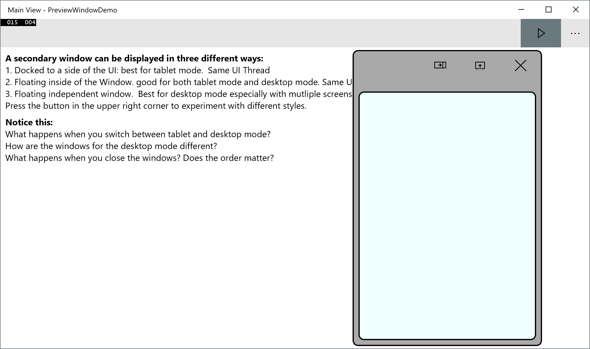

# UWP Child Window
UWP sample app that demonstrates how to implement multiple windows for both tablet and desktop modes.

## A secondary window can be displayed in three different ways:
1. Docked to a side of the UI: best for tablet mode.  Same UI Thread
2. Floating inside of the Window. good for both tablet mode and desktop mode. Same UI Thread.
3. Floating independent window.  Best for desktop mode especially with mutliple screens. Different UI Thread.

Press the button in the upper right corner to experiment with different styles.

## Notice this:
* What happens when you switch between tablet and desktop mode?
* How are the windows for the desktop mode different?
* What happens when you close the windows? Does the order matter?

